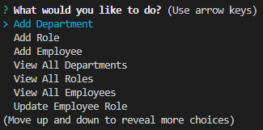

# 12 MySQL: Employee Tracker

[](https://opensource.org/licenses/MIT)

## Description

This is a command-line application that allows the user to view and manage the departments, roles, and employees of a company.

## Table of Contents

- [Installation](#installation)

- [Usage](#usage)

- [License](#license)

- [Questions](#questions)

## Installation

To install necessary dependencies, run the following command:

```
npm i
```

To launch the application, run the following command:

```
npm start
```

## Usage

Here's the link to my walkthrough video that demonstrates the app's functionality:  
[Employee Tracker Project Walkthrough Video!](https://drive.google.com/file/d/1T--L6_IcM3BIUufpP6rfepwFFoMJ6obN/view/)

The following image shows a mock-up of the application when launched:


## License

This project is licensed under the MIT license.  
https://opensource.org/licenses/MIT

## Questions

If you have any questions about the repo, open an issue or contact me directly at karenroh@hotmail.com.  
 You can find more of my work at [kroh1031](https://github.com/kroh1031).
